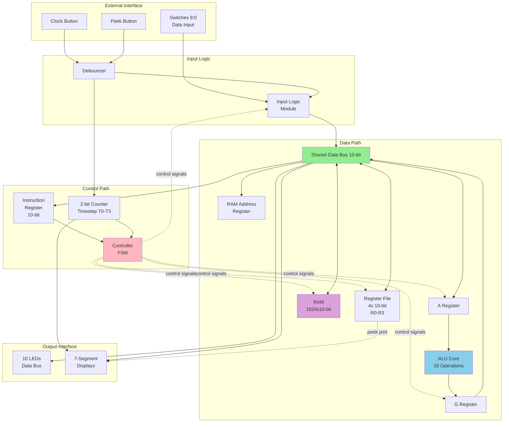

# BitBlaster 10-Bit Processor with RAM

A complete 10-bit RISC-style processor implemented in SystemVerilog for the Intel DE10-Lite FPGA board. Features a custom instruction set, multi-stage ALU, 1024x10-bit RAM, and 4 general-purpose registers. Built for educational purposes as part of a Digital Logic Design course at South Dakota State University.

---

## Key Features

✅ **Verified from source code:**

- **10-bit data bus architecture** - Shared bus connects all processor components ([`Bitblaster_10Bit_Processor.sv:29`](SV%20Module%20Files/Bitblaster_10Bit_Processor.sv))
- **16-instruction RISC-style ISA** - Arithmetic, logic, shift, immediate, and memory operations ([`controller.sv:34-48`](SV%20Module%20Files/controller.sv))
- **Multi-stage ALU** - Pipelined design with A and G intermediate registers ([`ALU.sv:10-87`](SV%20Module%20Files/ALU.sv))
- **4 general-purpose 10-bit registers** (R0-R3) with dual-port read capability ([`registerFile.sv:10-59`](SV%20Module%20Files/registerFile.sv))
- **1024x10-bit RAM** - Addressable memory with dedicated address register ([`ram_1024x10.sv`](SV%20Module%20Files/ram_1024x10.sv))
- **Hardware debounced inputs** - Clock and control button debouncing ([`debouncer.sv`](SV%20Module%20Files/debouncer.sv))
- **Visual debugging interface** - LEDs and 7-segment displays for real-time processor state monitoring ([`outputlogic.sv`](SV%20Module%20Files/outputlogic.sv))
- **4-cycle instruction execution** - Fetch, decode, execute, writeback pipeline (T0-T3 timesteps)

---

## Architecture Overview

The processor implements a classic Von Neumann architecture with a shared 10-bit data bus. All components communicate through this bus, controlled by a central controller that orchestrates data flow across 4 instruction timesteps.



**📖 See [docs/ARCHITECTURE.md](docs/ARCHITECTURE.md) for detailed module descriptions and data flow**

---

## Quickstart

### Prerequisites

- **Hardware**: [Intel DE10-Lite FPGA Board](https://www.terasic.com.tw/cgi-bin/page/archive.pl?Language=English&No=1021) (10M50DAF484C7G)
- **Software**: [Intel Quartus Prime Lite 22.1](https://www.intel.com/content/www/us/en/software-kit/773998/intel-quartus-prime-lite-edition-design-software-version-22-1-1-for-windows.html) or newer
- **Cable**: USB-Blaster or USB-Blaster II for programming

### Installation

1. **Clone the repository**
   ```bash
   git clone https://github.com/jakujobi/BitBlaster_10bit_with_RAM.git
   cd BitBlaster_10bit_with_RAM
   ```

2. **Open the project in Quartus**
   - Launch Quartus Prime Lite
   - Open `Bitblaster_10Bit_Processor/Bitblaster_10Bit_Processor.qpf`

3. **Compile the design**
   ```
   Processing → Start Compilation
   ```
   Or use keyboard shortcut: `Ctrl+L`

4. **Program the FPGA**
   ```
   Tools → Programmer
   ```
   - Connect your DE10-Lite board via USB
   - Click "Start" to program

### First Run

1. **Load an instruction** using switches SW[9:0]
   ```
   Example: Load value 42 into R0
   SW[9:0] = 0000000000  (LOAD instruction to R0)
   Press Clock Button
   
   SW[9:0] = 0000101010  (value 42)
   Press Clock Button 
   ```

2. **Monitor execution**
   - LEDs show current data bus value
   - HEX5 displays current timestep (0-3)
   - HEX2-0 show data bus value in hexadecimal

3. **Peek into registers**
   - Set SW[1:0] to register address (00=R0, 01=R1, etc.)
   - Hold Peek Button (KEY0)
   - HEX2-0 will display the register contents

---

## Usage

### Instruction Format

Instructions are 10 bits wide:

| Bits | Field | Description |
|------|-------|-------------|
| 9:8  | Opcode MSB | Instruction type (00=ALU, 10=ADDI, 11=SUBI) |
| 7:6  | Rx | Destination register |
| 5:4  | Ry | Source register |
| 3:0  | Function | ALU operation or immediate value LSBs |

### Instruction Set Architecture

#### Data Movement
```
ld  Rx        - Load external data to Rx          [00_RR_0000_0000]
cp  Rx, Ry    - Copy Ry to Rx (Rx ← [Ry])        [00_RR_RR_0001]
ldr Rx, Ry    - Load from RAM[Ry] to Rx          [00_RR_RR_1100]
str Rx, Ry    - Store Rx to RAM[Ry]              [00_RR_RR_1101]
```

#### Arithmetic Operations
```
add  Rx, Ry   - Add (Rx ← Rx + Ry)               [00_RR_RR_0010]
sub  Rx, Ry   - Subtract (Rx ← Rx - Ry)          [00_RR_RR_0011]
addi Rx, #imm - Add immediate (Rx ← Rx + imm)    [10_RR_IIIIII]
subi Rx, #imm - Subtract immediate (Rx ← Rx - imm) [11_RR_IIIIII]
inv  Rx, Ry   - Two's complement (Rx ← -Ry)      [00_RR_RR_0100]
```

#### Bitwise Operations
```
and Rx, Ry    - Bitwise AND (Rx ← Rx & Ry)       [00_RR_RR_0110]
or  Rx, Ry    - Bitwise OR (Rx ← Rx | Ry)        [00_RR_RR_0111]
xor Rx, Ry    - Bitwise XOR (Rx ← Rx ⊕ Ry)       [00_RR_RR_1000]
flp Rx, Ry    - Bitwise NOT (Rx ← ~Ry)           [00_RR_RR_0101]
```

#### Shift Operations
```
lsl Rx, Ry    - Logical shift left (Rx ← Rx << Ry)    [00_RR_RR_1001]
lsr Rx, Ry    - Logical shift right (Rx ← Rx >> Ry)   [00_RR_RR_1010]
asr Rx, Ry    - Arithmetic shift right (Rx ← Rx >>> Ry) [00_RR_RR_1011]
```

### Programming Examples

#### Example 1: Add Two Numbers
```
Step 1: Load 5 into R0
  Instruction: 0000000000 (ld R0)
  Data: 0000000101 (value 5)

Step 2: Load 3 into R1  
  Instruction: 0001000000 (ld R1)
  Data: 0000000011 (value 3)

Step 3: Add R0 + R1 → R2
  Instruction: 0010010010 (add R2, R1)
  
Result: R2 = 8
```

#### Example 2: Use RAM
```
Step 1: Load address 100 into R0
  Instruction: 0000000000 (ld R0)
  Data: 0001100100 (value 100)

Step 2: Load value 42 into R1
  Instruction: 0001000000 (ld R1)
  Data: 0000101010 (value 42)

Step 3: Store R1 to RAM[R0]
  Instruction: 0000011101 (str R0, R1)
  
Step 4: Load from RAM[R0] to R2
  Instruction: 0010001100 (ldr R2, R0)
  
Result: R2 = 42 (loaded from RAM address 100)
```

---

## Configuration

### Pin Assignments

The processor is fully pin-mapped for the DE10-Lite board:

| Component | Pin Mapping | Description |
|-----------|-------------|-------------|
| `Clock_50MHz` | PIN_P11 | System 50MHz clock |
| `Clock_Button` | PIN_B8 | Manual clock input (debounced) |
| `Peek_Button` | PIN_A7 | Register peek button |
| `Raw_Data_From_Switches[9:0]` | PIN_C10 to PIN_F15 | 10-bit data input |
| `LED_B_Data_Bus[9:0]` | PIN_A8 to PIN_B11 | Data bus LEDs |
| `DHEX0[6:0]` to `DHEX2[6:0]` | Various | 7-segment displays |
| `THEX_Current_Timestep[6:0]` | HEX5 | Timestep display |
| `LED_D_Done` | LED indicator | Instruction complete |

Full pin assignments are in [`Bitblaster_10Bit_Processor/Bitblaster_10Bit_Processor.qsf`](Bitblaster_10Bit_Processor/Bitblaster_10Bit_Processor.qsf)

### Clock Configuration

- **External Clock**: 50 MHz system clock (automatic)
- **Manual Clock**: Debounced push-button for single-step execution
- **Debounce Time**: ~100ms settling time (configurable in `debouncer.sv`)

---

## Project Structure

```
BitBlaster_10bit_with_RAM/
├── SV Module Files/           # SystemVerilog source files
│   ├── Bitblaster_10Bit_Processor.sv  # Top-level module
│   ├── controller.sv          # Main control FSM
│   ├── ALU.sv                 # Arithmetic Logic Unit
│   ├── registerFile.sv        # 4x10-bit register file
│   ├── ram_1024x10.sv         # 1KB RAM module
│   ├── inputlogic.sv          # Input handling & debouncing
│   ├── outputlogic.sv         # LED/HEX display driver
│   ├── reg10.sv               # 10-bit register (for IR)
│   ├── upcount2.sv            # 2-bit timestep counter
│   └── debouncer.sv           # Button debouncer
│
├── Bitblaster_10Bit_Processor/ # Quartus project files
│   ├── Bitblaster_10Bit_Processor.qpf  # Project file
│   ├── Bitblaster_10Bit_Processor.qsf  # Settings & pin assignments
│   └── output_files/          # Compiled bitstreams (generated)
│
├── Diagrams/                  # Architecture diagrams
│   ├── 10 bit processor diagram.drawio
│   └── Version 3/             # Latest design diagrams
│
├── Top Level View/            # Top-level schematic exports
│   ├── Top View of Bitblaster_10bit_processor_with_RAM.png
│   ├── Top View of Bitblaster_10bit_processor_with_RAM.svg
│   └── Top View of Bitblaster_10bit_processor_with_RAM.pdf
│
├── Project Report Solo/       # Project documentation
│   └── Bitblaster_10bit_Processor_Project Report.pdf
│
└── Files from Class/          # Reference materials
```

📖 **See [docs/DEVELOPMENT.md](docs/DEVELOPMENT.md) for development setup and workflow**

---

## Testing & Validation

### Manual Testing Procedure

1. **Basic Operation Test**
   - Load values into registers using `ld` instruction
   - Verify LED display shows correct values
   - Use peek function to confirm register contents

2. **ALU Operations Test**
   - Test arithmetic: `add`, `sub`, `addi`, `subi`, `inv`
   - Test logic: `and`, `or`, `xor`, `flp`
   - Test shifts: `lsl`, `lsr`, `asr`

3. **Memory Operations Test**
   - Store values to various RAM addresses using `str`
   - Load values back using `ldr`
   - Verify data persistence

4. **Timestep Verification**
   - Monitor HEX5 display during instruction execution
   - Verify 4-cycle execution (T0→T1→T2→T3→T0)

### Known Limitations

- No automated test suite currently available
- Testing requires physical DE10-Lite hardware
- Simulation files exist but are not pre-configured

---

## What This Project Demonstrates

**For recruiters and hiring managers:** This project showcases practical skills in digital design and computer architecture.

| Skill Area | Demonstrated By | Evidence |
|------------|-----------------|----------|
| **Digital Logic Design** | Complete processor implementation from gates to ISA | All `.sv` modules |
| **Hardware Description Languages** | ~1,200 lines of SystemVerilog | [`SV Module Files/`](SV%20Module%20Files/) |
| **Computer Architecture** | Von Neumann architecture, pipelined ALU, memory hierarchy | [`Bitblaster_10Bit_Processor.sv`](SV%20Module%20Files/Bitblaster_10Bit_Processor.sv) |
| **Finite State Machine Design** | Multi-timestep controller with 16 instruction states | [`controller.sv:53-270`](SV%20Module%20Files/controller.sv) |
| **Memory System Design** | Custom 1KB RAM with address registers and bus interface | [`ram_1024x10.sv`](SV%20Module%20Files/ram_1024x10.sv) |
| **FPGA Development** | Complete Quartus project with pin assignments, synthesis, timing | [`Bitblaster_10Bit_Processor/`](Bitblaster_10Bit_Processor/) |
| **Signal Processing** | Hardware debouncing circuits for reliable input | [`debouncer.sv`](SV%20Module%20Files/debouncer.sv) |
| **Low-Level Programming** | Direct instruction encoding and machine code execution | See instruction set above |
| **System Integration** | 9 modules integrated via shared bus architecture | [`Bitblaster_10Bit_Processor.sv`](SV%20Module%20Files/Bitblaster_10Bit_Processor.sv) |
| **Technical Documentation** | Comprehensive comments, diagrams, and project reports | Throughout repository |

---

## Development

### Building from Source

```bash
# Open in Quartus Prime Lite 22.1+
quartus Bitblaster_10Bit_Processor/Bitblaster_10Bit_Processor.qpf

# Compile (or use GUI: Processing → Start Compilation)
quartus_sh --flow compile Bitblaster_10Bit_Processor/Bitblaster_10Bit_Processor.qpf
```

### Module Hierarchy

```
Bitblaster_10Bit_Processor (top)
├── inputlogic
│   ├── debouncer (clock)
│   └── debouncer (peek)
├── upcount2 (timestep counter)
├── reg10 (instruction register)
├── controller (FSM)
├── registerFile (4 registers)
├── ram_1024x10 (memory)
├── ALU (arithmetic/logic)
└── outputlogic (display drivers)
```

---

## Project Status

**Status**: ✅ Complete and functional

This project was completed in Fall 2023 as part of a Digital Logic Design course at South Dakota State University. The processor successfully runs on DE10-Lite hardware and executes all 16 instructions correctly.

### Verified Functionality
- ✅ All 16 instructions execute correctly
- ✅ RAM read/write operations functional
- ✅ Register file operates reliably
- ✅ ALU performs all arithmetic/logic operations
- ✅ Hardware deployment successful on DE10-Lite

### Future Enhancements (Optional)
- Automated testbench in SystemVerilog
- Assembler tool for easier programming
- Expanded instruction set (jump, branch, compare)
- Interrupt handling
- Performance optimizations (reduce cycle count)

---

## Contributing

This is an academic project and is primarily maintained as a portfolio piece. However, suggestions and improvements are welcome:

1. Fork the repository
2. Create a feature branch (`git checkout -b feature/improvement`)
3. Commit your changes (`git commit -m 'Add improvement'`)
4. Push to the branch (`git push origin feature/improvement`)
5. Open a Pull Request

Please maintain the existing code style and add comments for any new logic.

---

## License

This project is licensed under the **GNU General Public License v3.0** - see the [LICENSE](LICENSE) file for details.

**Summary:**
- ✅ Free to use, modify, and distribute
- ✅ Must disclose source code
- ✅ Must use same GPL-3.0 license for derivatives
- ✅ Must include copyright notice

---

## Credits & Acknowledgements

### Authors
- **[John Akujobi](https://jakujobi.com/)** - Primary developer
  - Top-level integration, controller design, ALU, register file, I/O logic, RAM integration
  - Quartus project setup, pin assignments, debugging
  
- **LNU Sukhman Singh** - Collaborator
  - Controller development, debugging, testing, pin assignments

### Course Information
- **Institution**: South Dakota State University
- **Course**: Digital Logic Design (CSC 244)
- **Semester**: Fall 2023
- **Target Hardware**: Intel DE10-Lite FPGA Board

### Tools & Resources
- Intel Quartus Prime Lite 22.1 - FPGA synthesis and implementation
- ModelSim - Simulation (optional)
- Draw.io - Architecture diagrams

---

## Additional Resources

- 📘 [Intel DE10-Lite User Manual](https://www.terasic.com.tw/cgi-bin/page/archive.pl?Language=English&No=1021)
- 📗 [Quartus Prime User Guide](https://www.intel.com/content/www/us/en/docs/programmable/683705/22-1/introduction.html)
- 📕 [SystemVerilog IEEE 1800-2017 Standard](https://ieeexplore.ieee.org/document/8299595)
- 📙 Project Report: [`Project Report Solo/Bitblaster_10bit_Processor_Project Report.pdf`](Project%20Report%20Solo/Bitblaster_10bit_Processor_Project%20Report.pdf)

---

## Questions or Issues?

For questions about this project, please:
1. Check the [Project Report](Project%20Report%20Solo/Bitblaster_10bit_Processor_Project%20Report.pdf) for detailed design documentation
2. Review the [architecture documentation](docs/ARCHITECTURE.md)
3. Open an issue on GitHub with your question

---

<div align="center">

**Built with ❤️ for learning and education**

*Last Updated: February 2024*

</div>
