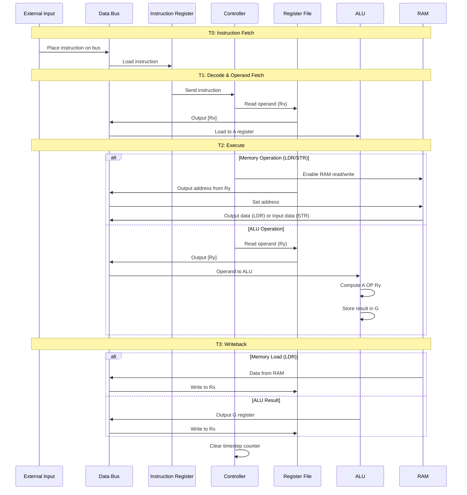

# Architecture Documentation

## Table of Contents
- [System Overview](#system-overview)
- [Data Flow](#data-flow)
- [Module Descriptions](#module-descriptions)
- [Instruction Execution Pipeline](#instruction-execution-pipeline)
- [Control Signals](#control-signals)
- [Bus Architecture](#bus-architecture)

---

## System Overview

The BitBlaster 10-bit processor implements a classic Von Neumann architecture with a shared data bus. The design emphasizes educational clarity while maintaining functionality for a complete instruction set.

### Design Philosophy

1. **Shared Bus Architecture**: Single 10-bit bus reduces wiring complexity and demonstrates bus arbitration
2. **Multi-Stage ALU**: Pipelined design with intermediate registers (A, G) for efficient operation
3. **Timestep-Based Control**: 4-cycle instruction execution (T0-T3) simplifies control logic
4. **Visual Feedback**: LEDs and 7-segment displays enable real-time debugging

### Key Specifications

| Parameter | Value | Notes |
|-----------|-------|-------|
| Data Width | 10 bits | Chosen for DE10-Lite switch/LED count |
| Address Space | 10 bits | 1024 addressable RAM locations |
| Registers | 4 × 10-bit | R0, R1, R2, R3 |
| RAM Size | 1024 × 10-bit | 1.25 KB total |
| Instructions | 16 | 13 ALU ops + 2 immediate + 2 memory |
| Clock Speed | Manual or 50 MHz | Debounced manual for debugging |
| Execution Cycles | 4 per instruction | T0=Fetch, T1=Decode/Read, T2=Execute, T3=Writeback |

---

## Data Flow

### Instruction Execution Flow



### Data Bus Arbitration

The shared 10-bit data bus uses tri-state logic (`10'bz`) to prevent contention. Only one module drives the bus at any time, controlled by enable signals from the controller.

**Bus Drivers** (in order of typical activation):

1. **Input Logic** (`Extrn_Enable_Signal`) - T0 for instruction fetch
2. **Register File Q0** (`ENR_ENR0`) - T1/T2 for operand reads
3. **ALU G Register** (`Gout_Gout`) - T3 for ALU result writeback
4. **RAM Data Output** (`EN_RAM_to_BUS`) - T2 for memory loads (LDR)
5. **Controller IMM Output** - T2 for immediate value operations

**Example Bus Access Pattern (ADD R0, R1):**
```
T0: Input Logic → Bus (instruction 0000_0100_0010)
T1: R0 → Bus → ALU A register
T2: R1 → Bus → ALU (compute)
T3: ALU G → Bus → R0
```

---

## Module Descriptions

### 1. Top-Level Module (`Bitblaster_10Bit_Processor`)

**File**: [`SV Module Files/Bitblaster_10Bit_Processor.sv`](../SV%20Module%20Files/Bitblaster_10Bit_Processor.sv)

**Purpose**: Integrates all submodules and routes signals between them.

**I/O Ports**:
```systemverilog
input  logic [9:0] Raw_Data_From_Switches  // External data input
input  logic Clock_50MHz                    // System clock
input  logic Peek_Button                    // Peek into registers
input  logic Clock_Button                   // Manual clock

output logic [9:0] LED_B_Data_Bus          // Data bus LEDs
output logic [6:0] DHEX0, DHEX1, DHEX2     // Value displays
output logic [6:0] THEX_Current_Timestep   // Timestep display
output logic LED_D_Done                     // Instruction done LED
```

**Internal Signals**:
- `Shared_Data_Bus [9:0]` - Main data bus (wire type for multiple drivers)
- `Timestep_2_bits [1:0]` - Current execution timestep (00→01→10→11→00)
- `Instruction_From_IR [9:0]` - Decoded instruction
- Control signals for each module (ENW, ENR, Ain, Gin, etc.)

---

### 2. Controller (`controller`)

**File**: [`SV Module Files/controller.sv`](../SV%20Module%20Files/controller.sv)

**Purpose**: Central finite state machine that generates all control signals based on current instruction and timestep.

**Design**: Combinational logic (`always_comb`) implements a 4-state FSM:

```
State T0 (2'b00): Instruction Fetch
  - Assert Ext (external input enable)
  - Assert IRin (load instruction register)
  
State T1 (2'b01): Decode & First Operand
  - Decode instruction type
  - For most ops: Read Rx → Bus → ALU A register
  - For LOAD/COPY/LDR/STR: Execute single-cycle ops
  
State T2 (2'b10): Execute
  - For ALU ops: Read Ry → Bus → ALU, compute, store in G
  - For memory ops: Access RAM with address from Ry
  - For immediate ops: Place IMM on bus, compute
  
State T3 (2'b11): Writeback
  - Write result to destination register
  - Assert Clr (reset timestep counter)
```

**Control Signals Generated**:

| Signal | Width | Purpose |
|--------|-------|---------|
| `ENW` | 1 | Enable register file write |
| `ENR` | 1 | Enable register file read (Q0 port) |
| `Rin [1:0]` | 2 | Write address for register file |
| `Rout [1:0]` | 2 | Read address for register file |
| `Ain` | 1 | Load ALU A register |
| `Gin` | 1 | Store ALU result in G register |
| `Gout` | 1 | Output ALU G register to bus |
| `ALUcont [3:0]` | 4 | ALU operation select |
| `Ext` | 1 | Enable external data input |
| `IRin` | 1 | Load instruction register |
| `Clr` | 1 | Clear timestep counter |
| `RAM_read_from_RAM` | 1 | Enable RAM read |
| `RAM_write_to_RAM` | 1 | Enable RAM write |
| `EN_AddressRegRead` | 1 | Load RAM address register |

**Instruction Decoding**:

```systemverilog
// Extract fields from 10-bit instruction
INST[9:8]  - Instruction class (00=ALU, 10=ADDI, 11=SUBI)
INST[7:6]  - Rx (destination register)
INST[5:4]  - Ry (source register)
INST[3:0]  - Function code (for ALU ops) or immediate LSBs
```

---

### 3. Arithmetic Logic Unit (`ALU`)

**File**: [`SV Module Files/ALU.sv`](../SV%20Module%20Files/ALU.sv)

**Purpose**: Performs all arithmetic and logical operations using a multi-stage pipeline.

**Architecture**:

```
Input → [A Register] → [Combinational ALU] → [G Register] → Output
         (Ain)                                  (Gin)          (Gout)
```

**Pipeline Stages**:

1. **A Register** (10-bit, negative-edge triggered)
   - Loads operand from bus when `Ain` is high
   - Holds value across multiple clock cycles
   
2. **Combinational ALU Core**
   - Implements 14 operations via case statement
   - Inputs: A register, OP from bus, FN code
   - Output: Result_from_ALU (combinational)
   
3. **G Register** (10-bit, negative-edge triggered)
   - Stores result when `Gin` is high
   - Holds result until ready for writeback
   
4. **Output Stage**
   - Tri-state buffer controlled by `Gout`
   - `Gout=1`: Drive bus with G register
   - `Gout=0`: High-impedance (10'bz)

**Supported Operations**:

| Code | Mnemonic | Operation | Implementation |
|------|----------|-----------|----------------|
| 0000 | LOAD | Pass through | `OP` |
| 0001 | COPY | Copy A | `A` |
| 0010 | ADD | Addition | `A + OP` |
| 0011 | SUB | Subtraction | `A - OP` |
| 0100 | INV | Two's complement | `(~OP) + 1` |
| 0101 | FLIP | Bitwise NOT | `~A` |
| 0110 | AND | Bitwise AND | `A & OP` |
| 0111 | OR | Bitwise OR | `A \| OP` |
| 1000 | XOR | Bitwise XOR | `A ^ OP` |
| 1001 | LSL | Logical shift left | `A << OP` |
| 1010 | LSR | Logical shift right | `A >> OP` |
| 1011 | ASR | Arithmetic shift right | `$signed(A) >>> OP` |
| 1100 | ADDI | Add immediate | `A + OP` (IMM on OP) |
| 1101 | SUBI | Subtract immediate | `A - OP` (IMM on OP) |

**Timing**:
- Both A and G registers trigger on negative clock edge
- Allows full clock cycle for combinational logic propagation
- Prevents setup/hold violations

---

### 4. Register File (`registerFile`)

**File**: [`SV Module Files/registerFile.sv`](../SV%20Module%20Files/registerFile.sv)

**Purpose**: Stores processor state in 4 general-purpose registers with dual-read capability.

**Architecture**:
```
        ┌─────────────────────────┐
        │   Register File         │
D[9:0]─→│  ┌───┐ ┌───┐           │
WRA[1:0]│→ │R0 │ │R1 │           │
ENW ───→│  └───┘ └───┘           │
        │  ┌───┐ ┌───┐           │
RDA0[1:0│→ │R2 │ │R3 │ ──→Q0[9:0]│
RDA1[1:0│→ └───┘ └───┘ ──→Q1[9:0]│
ENR0 ───│→                        │
ENR1 ───│→                        │
        └─────────────────────────┘
```

**Key Features**:

1. **Single Write Port**:
   - Address: `WRA[1:0]` selects R0-R3
   - Data: `D[9:0]` from data bus
   - Enable: `ENW` (active high)
   - Timing: Negative-edge triggered

2. **Dual Read Ports** (uses same physical registers):
   - **Q0 Port**: Connected to data bus (primary operand path)
     - Address: `RDA0[1:0]`
     - Enable: `ENR0`
     - Tri-state output (10'bz when disabled)
   
   - **Q1 Port**: Connected to output logic (peek functionality)
     - Address: `RDA1[1:0]` (driven by SW[1:0])
     - Enable: `ENR1` (always high when peek button pressed)
     - Independent of bus

3. **Initialization**: All registers initialized to 10'b0 on startup

**Example Usage**:
```
Write to R2:
  WRA = 2'b10, ENW = 1, D = 10'b0000101010
  On negative clock edge: R2 ← 42

Read from R1 to bus:
  RDA0 = 2'b01, ENR0 = 1
  Immediately: Q0 = [R1] (combinational)
  
Peek into R3:
  RDA1 = 2'b11, ENR1 = 1
  Immediately: Q1 = [R3] → HEX displays
```

---

### 5. RAM Module (`ram_1024x10`)

**File**: [`SV Module Files/ram_1024x10.sv`](../SV%20Module%20Files/ram_1024x10.sv)

**Purpose**: Provides 1024 words of 10-bit memory for data storage.

**Architecture**:

```
       ┌────────────────────────┐
address│  ┌─────────────────┐   │
───────│→ │ Address Register│   │
EN_Addr│  │   (10-bit)      │   │
Read ─→│  └────────┬────────┘   │
       │           ↓             │
       │  ┌─────────────────┐   │
       │  │  Memory Array   │   │
data_in│  │  [0:1023]       │   │
───────│→ │  10-bit words   │──→│data_out
EN_write  └─────────────────┘   │
       └────────────────────────┘
```

**Components**:

1. **Address Register** (`Stored_Address[9:0]`)
   - Latches address on negative clock edge when `EN_AddressRegRead` high
   - Allows address setup separate from data operation
   - Enables two-cycle memory operations

2. **Memory Array** (`memory_array[1023:0]`)
   - 1024 locations × 10 bits = 1.25 KB
   - Implemented as logic array (synthesizes to block RAM on FPGA)
   - No initialization (undefined on power-up)

3. **Write Logic** (negative-edge triggered)
   ```systemverilog
   if (EN_write_to_RAM)
       memory_array[Stored_Address] ← data_in
   ```

4. **Read Logic** (combinational with tri-state)
   ```systemverilog
   if (EN_read_from_RAM)
       data_out = memory_array[Stored_Address]
   else
       data_out = 10'bz
   ```

**LDR/STR Instruction Execution**:

```
LDR R0, R1  (Load from RAM[R1] to R0):
  T1: R1 → Bus → Address Register
      (EN_AddressRegRead = 1)
  T2: RAM[Stored_Address] → Bus
      (RAM_read_from_RAM = 1)
      Bus → R0
      (ENW = 1, Rin = R0 address)

STR R0, R1  (Store R0 to RAM[R1]):
  T1: R1 → Bus → Address Register
      (EN_AddressRegRead = 1)
  T2: R0 → Bus → RAM[Stored_Address]
      (ENR = 1, Rout = R0 address)
      (RAM_write_to_RAM = 1)
```

---

### 6. Input Logic (`inputlogic`)

**File**: [`SV Module Files/inputlogic.sv`](../SV%20Module%20Files/inputlogic.sv)

**Purpose**: Interface between physical DE10-Lite inputs and processor internals.

**Functions**:

1. **Button Debouncing**:
   - Two debouncer instances for Clock and Peek buttons
   - Filters mechanical bounce noise
   - Produces clean single-edge signals

2. **Data Routing**:
   - Routes `RawData[9:0]` to bus when `Extrn_Enable` active
   - Otherwise outputs high-impedance (10'bz)

3. **Peek Data Extraction**:
   - Extracts `data2bit = RawData[1:0]`
   - Used as `RDA1` for register file peek function

---

### 7. Output Logic (`outputlogic`)

**File**: [`SV Module Files/outputlogic.sv`](../SV%20Module%20Files/outputlogic.sv)

**Purpose**: Drives LEDs and 7-segment displays for debugging.

**Outputs**:

1. **LED_B[9:0]**: Directly mirrors data bus
   - Real-time binary display of bus contents

2. **DHEX2:0**: Three 7-segment displays
   - Shows hexadecimal value (0-3FF)
   - Multiplexed between bus and register peek:
     - `Pkb=1`: Display data bus value
     - `Pkb=0`: Display register from Q1 port

3. **THEX**: Timestep display
   - Shows current instruction phase (0, 1, 2, 3)

4. **LED_D**: Done indicator
   - Active when `Clr` signal high (instruction complete)
   - Active-low LED (inverted in code)

**7-Segment Encoding**:
- Custom functions convert 10-bit values to hexadecimal digits
- Each digit encoded as 7-bit pattern for segments a-g
- Supports 0-9 and A-F for full hexadecimal range

---

### 8. Supporting Modules

#### Instruction Register (`reg10`)
**File**: [`SV Module Files/reg10.sv`](../SV%20Module%20Files/reg10.sv)
- 10-bit register with enable
- Holds current instruction throughout execution
- Negative-edge triggered

#### Timestep Counter (`upcount2`)
**File**: [`SV Module Files/upcount2.sv`](../SV%20Module%20Files/upcount2.sv)
- 2-bit up-counter (00→01→10→11→00)
- Synchronous clear (Clr)
- Drives controller state machine

#### Debouncer (`debouncer`)
**File**: [`SV Module Files/debouncer.sv`](../SV%20Module%20Files/debouncer.sv)
- Digital low-pass filter for mechanical buttons
- Uses 50 MHz clock to sample input
- Settles after ~100ms of stable signal
- Prevents multiple triggers from single press

---

## Instruction Execution Pipeline

### Detailed Timestep Breakdown

#### T0: Instruction Fetch
```
External Input → Data Bus → Instruction Register

Controller actions:
  Ext = 1           (enable external input to bus)
  IRin = 1          (latch instruction into IR)
  
Result: Instruction loaded, ready for decode
```

#### T1: Decode and First Operand

**For ALU operations (add, sub, and, or, etc.):**
```
Rx → Data Bus → ALU A Register

Controller actions:
  Rout = INST[7:6]  (select Rx)
  ENR = 1           (enable register read)
  Ain = 1           (latch into ALU A)
  
Result: First operand staged in ALU
```

**For LOAD:**
```
External Input → Data Bus → Rx

Controller actions:
  Ext = 1           (enable external input)
  Rin = INST[7:6]   (select Rx)
  ENW = 1           (write to register)
  Clr = 1           (done - single cycle instruction)
```

**For COPY:**
```
Ry → Data Bus → Rx

Controller actions:
  Rout = INST[5:4]  (select Ry)
  ENR = 1           (enable read)
  Rin = INST[7:6]   (select Rx)
  ENW = 1           (enable write)
  Clr = 1           (done - single cycle)
```

**For LDR/STR:**
```
Ry → Data Bus → RAM Address Register

Controller actions:
  Rout = INST[5:4]  (select Ry - holds address)
  ENR = 1           (enable read)
  EN_AddressRegRead = 1  (latch address)
```

#### T2: Execute

**For ALU operations:**
```
Ry → Data Bus → ALU → G Register

Controller actions:
  Rout = INST[5:4]  (select Ry)
  ENR = 1           (enable read)
  ALUcont = INST[3:0]  (select operation)
  Gin = 1           (latch result)
  
Result: A OP Ry → G
```

**For Immediate operations (ADDI/SUBI):**
```
IMM → Data Bus → ALU → G Register

Controller actions:
  IMM[5:0] = INST[5:0]  (extract immediate)
  IMM[9:6] = 4'b0000    (zero-extend)
  ALUcont = 0010/0011   (add/sub)
  Gin = 1               (latch result)
```

**For LDR (load from RAM):**
```
RAM[Address] → Data Bus → Rx

Controller actions:
  RAM_read_from_RAM = 1  (enable RAM output)
  Rin = INST[7:6]        (select Rx)
  ENW = 1                (write to register)
  Clr = 1                (done)
```

**For STR (store to RAM):**
```
Rx → Data Bus → RAM[Address]

Controller actions:
  Rout = INST[7:6]       (select Rx)
  ENR = 1                (enable read)
  RAM_write_to_RAM = 1   (enable RAM write)
  Clr = 1                (done)
```

#### T3: Writeback

**For ALU operations:**
```
ALU G Register → Data Bus → Rx

Controller actions:
  Gout = 1          (enable G output)
  Rin = INST[7:6]   (select Rx)
  ENW = 1           (write to register)
  Clr = 1           (reset counter)
```

**Note**: LOAD, COPY, LDR, and STR complete in T1 or T2 and skip T3.

---

## Control Signals

### Signal Timing Diagram

```
Clock    ___╱───╲___╱───╲___╱───╲___╱───╲___
         T0      T1      T2      T3      T0

For ADD R0, R1:

Ext      ───┐___________________________
IRin     ───┐___________________________
Timestep ─0─┐─1─┐─2─┐─3─┐─0─────────────
Rout     ───┐R0─┐R1─┐───────────────────
ENR      ───────┐───┐───┐_______________
Ain      ───────┐───┐___________________
ALUcont  ───────────┐ADD┐_______________
Gin      ───────────────┐───┐___________
Gout     ───────────────────┐───┐_______
Rin      ───────────────────┐R0─┐_______
ENW      ───────────────────────┐───┐___
Clr      ───────────────────────────┐───
```

### Critical Signal Interactions

1. **Bus Contention Prevention**:
   - Only one of {Ext, ENR, Gout, RAM_read} can be high
   - Controller ensures mutual exclusion

2. **Register File Timing**:
   - Read is combinational (ENR → Q0 immediately)
   - Write is sequential (ENW + clock edge → register)
   - Allows read-modify-write in same instruction

3. **ALU Pipeline Control**:
   - Ain and Gin never asserted simultaneously
   - Gout only in T3, after result stable in G
   - Prevents feedback loops

---

## Bus Architecture

### Bus Structure

```
10-bit Shared Data Bus (wire type)
│
├─ Input Logic (Ext enable)
├─ Register File Q0 (ENR enable)
├─ ALU G Register (Gout enable)
├─ RAM Data Out (RAM_read enable)
├─ Controller IMM (for immediate instructions)
│
└─ Tri-state: All outputs default to 10'bz when disabled
```

### Bus Priority

No hardware priority encoder exists. Controller FSM ensures only one driver active per cycle. If multiple enables asserted simultaneously, bus contention occurs (undefined behavior).

### Bus Loading

All modules present minimal capacitive load:
- Register file: One tri-state buffer
- ALU: One tri-state buffer
- RAM: One tri-state buffer
- Input logic: One tri-state buffer

No repeaters or buffers needed for 10-bit width.

---

## Clock Domains

### Primary Clock (CLKb)
- Source: Debounced manual button OR 50 MHz oscillator
- All sequential elements (registers, counters) use negative edge
- Debouncer uses 50 MHz for sampling

### Why Negative Edge?

Negative-edge triggering provides:
1. Full clock cycle for combinational logic setup
2. Clean separation between read and write operations
3. Easier timing analysis for students

**Timing Budget** (assuming 50 MHz clock):
- Clock period: 20ns
- Combinational path: ~15ns available
- Setup/hold margin: ~5ns

---

## Memory Map

The processor has two distinct memory spaces:

### Register File (Internal State)
```
Address | Register | Access
--------|----------|--------
00      | R0       | Read/Write
01      | R1       | Read/Write
10      | R2       | Read/Write
11      | R3       | Read/Write
```

### RAM (External Data)
```
Address Range | Size  | Purpose
--------------|-------|--------
0x000-0x3FF   | 1024  | General purpose data storage
```

No memory-mapped I/O exists. All I/O is through dedicated ports.

---

## FPGA Resource Utilization

**Target Device**: Intel MAX 10 (10M50DAF484C7G)

**Estimated Resource Usage** (typical synthesis):

| Resource Type | Used | Available | Utilization |
|---------------|------|-----------|-------------|
| Logic Elements | ~500 | 50,000 | ~1% |
| Registers | ~150 | - | - |
| Block RAM bits | ~10,240 | 1,638,400 | <1% |
| Pins | ~50 | 360 | ~14% |

**Critical Paths** (typical):
- Controller combinational logic: ~8ns
- ALU computation: ~10ns
- Register file read: ~2ns

All paths meet timing for 50 MHz clock with margin.

---

## Design Tradeoffs

### Choices Made

1. **Shared Bus vs Dedicated Paths**
   - ✅ Chosen: Shared bus
   - Why: Reduces complexity, easier to debug, sufficient for educational purposes
   - Tradeoff: Lower performance (bus conflicts require careful scheduling)

2. **4-Cycle Execution vs Single-Cycle**
   - ✅ Chosen: 4-cycle (T0-T3)
   - Why: Simplifies control logic, natural pipelining demonstration
   - Tradeoff: 4× slower than ideal single-cycle (acceptable for manual stepping)

3. **10-bit Width vs 8/16/32-bit**
   - ✅ Chosen: 10-bit
   - Why: Matches DE10-Lite switch count, unique teaching point
   - Tradeoff: Non-standard (but still supports all fundamental operations)

4. **4 Registers vs 8/16**
   - ✅ Chosen: 4 registers
   - Why: Sufficient for instruction set, reduces decoder complexity
   - Tradeoff: More register pressure in complex programs

5. **1KB RAM vs More**
   - ✅ Chosen: 1024×10-bit (1.25 KB)
   - Why: Demonstrates full address space with 10-bit addresses
   - Tradeoff: Limited program/data size

---

## Future Enhancement Possibilities

### Performance
- [ ] Reduce critical ALU operations to 2-3 cycles
- [ ] Add pipeline forwarding (bypass A/G registers when safe)
- [ ] Dual-port RAM for simultaneous I/D access

### Functionality
- [ ] Conditional branches (BEQ, BNE, BLT, etc.)
- [ ] Jump instructions (absolute and relative)
- [ ] Stack pointer and PUSH/POP
- [ ] Interrupt handling mechanism

### Debugging
- [ ] UART interface for easier programming
- [ ] Instruction trace buffer
- [ ] Breakpoint support

---

## References

- SystemVerilog IEEE 1800-2017 Standard
- Intel MAX 10 FPGA Device Handbook
- DE10-Lite User Manual
- Digital Design and Computer Architecture (Harris & Harris)

---

*This document describes the design as implemented in Fall 2023. For questions or clarifications, refer to the source code comments.*
